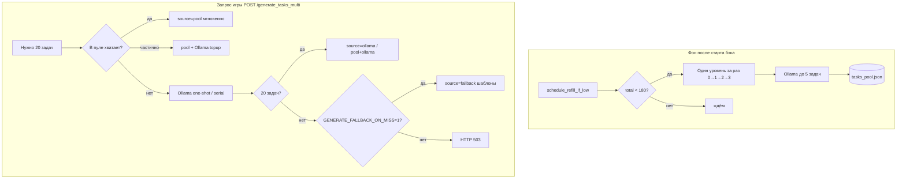

# Как сервер выдаёт задания (пул, Ollama, fallback)

Кратко для команды и для настройки `.env` на VPS.

**Учебный каталог (20 заданий):** `beck/tasks_fallback_catalog.py` — тот же набор в `db/task_data.gd` и при `source=fallback`. См. [EDUCATION.md](EDUCATION.md).

## Две разные задачи

| Кто запрашивает | Цель | Скорость |
|-----------------|------|----------|
| **Игрок** («Новая игра») | Сразу **20 задач** (4 уровня × 5) в БД игры | Секунды, если есть пул |
| **Фон (пул)** | Держать **запас** до **300** AI-задач (75×4) на диске | Медленно, в фоне, по одному уровню |

Это **не одно и то же**: пул пополняется отдельно; игрок забирает из пула или получает дозаполнение через Ollama в момент запроса.

---

## Схема



---

## Watchdog зависших Ollama runner (`deploy/ollama_runner_killer.sh`)

Таймер systemd каждые **2 мин** убивает зависшие `ollama runner` на **:11434** (не трогает `ollama-check` на :11435):

- работает дольше **660 с** (~11 min, чуть больше `OLLAMA_SINGLE_TIMEOUT=600`);
- или runner'ов больше **1** (лишние старые);
- или CPU-spin (огромный CPU при age ≥ 5 min).

Установка на VPS:

```bash
python scripts/setup_ollama_watchdog_remote.py
```

Логи: `journalctl -t ollama-runner-killer -n 30`  
Настройка: `/etc/default/ollama-runner-watchdog`

## Разнообразие заданий (`beck/task_diversity.py`)

- **print** на уровне 0 допустим часто; режется не print, а **один и тот же контекст/вывод** (три раза «Привет друг»).
- При добавлении в пул и при генерации Ollama сравниваются `description`, `expected_output` и «семейство» приветственных строк.
- Переменные: `TASK_SIMILAR_MAX_PER_GROUP=3` (до 3 похожих на уровень; 4-я отсекается), опционально `TASK_GREETING_CONTEXT_MAX_PER_LEVEL`.
- При старте: `TASK_POOL_PRUNE_SIMILAR_ON_LOAD=1` — чистка дубликатов в `tasks_pool.json`.

## Пул на диске (`tasks_pool.json`)

- Включён: `TASK_POOL_ENABLED=1`
- Цель: **75 задач на уровень** × 4 = **300** (`TASK_POOL_TARGET_PER_LEVEL`, `TASK_POOL_MIN_TOTAL`)
- **Старт:** `TASK_POOL_SEED_CATALOG=1` — сразу **20** задач из `tasks_fallback_catalog.py` (5×4), если пул пустой.
- **Refill** (`beck/pool_refill.py`): **qwen2.5:3b** на `:11434`; промпт = программа уровня + примеры из `tasks_fallback_catalog.py`.
- **Проверка** (`/check_task`): **qwen2.5:0.5b** на `:11435` — логика в `check_service.py` без изменений.
- Пока идёт `/check_task`, refill **ставится на паузу** и **прерывает** текущий HTTP к Ollama; после проверки — повтор прерванной попытки + worker.
- **Фоновый refill** (пока `total < 300`):
  1. Уровень с **наименьшим** запасом (`pick_level_for_refill`).
  2. До **`TASK_POOL_REFILL_CHUNK`** запросов по **1 задаче** (большая модель).
  3. Успех → в пул; дубликаты шаблонов от Ollama отбрасываются (`strip_fallback_tasks`).
  4. Ollama не ответил → **`TASK_POOL_CATALOG_ON_MISS=1`**: в пул кладутся задачи **каталога** для этого уровня (без strip).
  5. Пустой батч → **пауза** `TASK_POOL_REFILL_RETRY_SEC` (90 с) и **повтор** (раньше цикл останавливался).
- Задания про **дату/datetime** при загрузке и `add_tasks` **удаляются**.
- `OLLAMA_WARMUP_ENABLED=0` на проде — refill стартует сразу, не ждёт 3 прогрева.

**Оценка на 4 vCPU:** ~3–7 мин на батч из 4 AI-задач; после seed ≈ **5–12 ч** до 240. С `CATALOG_ON_MISS` быстрее (часть слотов — каталог, до 60 на уровень).

Проверка: `GET /health` → `task_pool_total`, `task_pool_by_level`.

### Логи refill (с ПК)

```powershell
$env:DEPLOY_SSH_PASSWORD = "ваш_пароль"
python scripts/watch_refill_logs_remote.py          # последние строки
python scripts/watch_refill_logs_remote.py --follow # онлайн, Ctrl+C выход
python scripts/server_status_remote.py            # health + 30 строк логов
python scripts/monitor_levels_8.py                # ждёт >=8 на уровень, пишет POOL_MONITOR_OUTPUT/
```

На сервере по SSH: `journalctl -u collage-backend -f` (все логи бэка). Refill пишет строки `task_pool:`, `pool_refill:`.

---

## Запрос игрока (`/generate_tasks_multi`)

Порядок в коде (`beck/routes/generate_routes.py`):

1. **Пул** — забрать до 5 задач с каждого запрошенного уровня. Если набралось 20 → `source: "pool"`.
2. **Дозаполнение Ollama** — чего не хватило в пуле, добрать по уровням → `pool+ollama` или `ollama`.
3. **One-shot** (если `TASK_MULTI_ONESHOT_FIRST=1`) — один запрос на все уровни.
4. **Serial** — по уровням, как в фоне.
5. Если всё ещё не 20 задач:
   - **`GENERATE_FALLBACK_ON_MISS=1`** (рекомендуется на слабом VPS) → **HTTP 200**, `source: "fallback"`, 20 **шаблонных** задач из кода (игра стартует сразу).
   - **`GENERATE_FALLBACK_ON_MISS=0`** → **HTTP 503** (клиент ждёт / повторяет / берёт локальный `task_data.gd`).

### Fallback vs ждать Ollama

| Вариант | Плюсы | Минусы |
|---------|-------|--------|
| **Fallback с сервера** (`GENERATE_FALLBACK_ON_MISS=1`) | «Новая игра» не висит 10 мин; предсказуемый UX | Задания не уникальные, те же шаблоны |
| **Ждать Ollama** (fallback=0, длинный timeout клиента) | Уникальные задачи | На 4 vCPU часто 5–10+ мин, обрывы, 503 |
| **Пул заранее заполнен** | Быстро + задачи уже на сервере | Нужно время на фоновый refill или ручной seed |

**Практика для продакшена:** пул держать ≥ 20 задач (хотя бы seed/fallback в файле для аварии) + `GENERATE_FALLBACK_ON_MISS=1` + фоновый refill AI по уровням.

---

## Клиент Godot (`new_game_loading.gd`)

1. `POST /generate_tasks_multi` (таймаут **120 с**).
2. Принимает ответ с `source`: `pool`, `ollama`, `pool+ollama`, **`fallback`**.
3. Если пусто / 503 / ошибка сети → по уровням `/generate_tasks` → иначе локальный `res://db/task_data.gd`.

Скрипт разработки `beck/generate_tasks_to_gd.py` **специально отбрасывает** `source=fallback` и крутит retry — это для **генерации `task_data.gd`**, не для игрока в рантайме.

---

## Переменные `.env` (главные)

```env
TASK_POOL_ENABLED=1
TASK_POOL_TARGET_PER_LEVEL=60
TASK_POOL_MIN_TOTAL=240
TASK_POOL_REFILL_CHUNK=4
TASK_POOL_REFILL_ONE_LEVEL_PER_BATCH=1
TASK_POOL_SEED_CATALOG=1
TASK_POOL_CATALOG_ON_MISS=1
TASK_POOL_REFILL_RETRY_SEC=90
OLLAMA_POOL_NUM_PREDICT=512
OLLAMA_WARMUP_ENABLED=0

GENERATE_FALLBACK_ON_MISS=1

OLLAMA_SINGLE_TIMEOUT=600
OLLAMA_MULTI_TIMEOUT=900
```

Деплой + `.env` на VPS: `python scripts/deploy_remote.py`, затем `python scripts/apply_production_env_remote.py`.

### A2 + D2 (проверка vs генерация)

| Механизм | Что делает |
|----------|------------|
| **A2** | Пока идёт `POST /check_task`, фоновый refill **ждёт** (не занимает Ollama :11434). |
| **D2** | Проверка 2+ → Ollama **:11435** + `qwen2.5:0.5b`; генерация/refill → **:11434** + `qwen2.5:3b`. Пул всегда целится в **240** (`TASK_POOL_MIN_TOTAL`). |

Установка второго Ollama на сервере:

```bash
python scripts/setup_ollama_check_remote.py
```

---

## Частые вопросы

**Почему в `/health` нули, а игра всё равно работает?**  
Сработает `GENERATE_FALLBACK_ON_MISS` или локальный `task_data.gd`. После деплоя с seed обычно сразу **20+**.

**Почему refill «долгий»?**  
Ollama на CPU; один запрос за раз. Ночью цикл **не останавливается** после ошибки.

**Каталог в пуле — это fallback?**  
Да, те же 20 формулировок; при `CATALOG_ON_MISS` и seed они **допустимы** в `tasks_pool.json`. Игроку при «Новой игре» по-прежнему может уйти `source=fallback`, если пул пуст.
